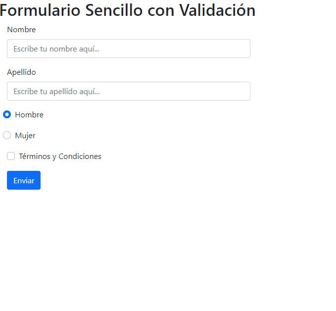

# WDF M6 S12: Formulario Sencillo con Validación

## **ÍNDICE**

* [1. Intro](#1-intro)
* [2. Demo](#2-demo)
* [3. ¿Qué construirás?](#3-qu%C3%A9-construir%C3%A1s)
* [4. Objetivos de Aprendizaje](#4-objetivos-de-aprendizaje)
* [5. Requisitos](#5-requisitos-y-entregables)

****

## 1. Intro

En JavaScript, la interacción con el usuario se consigue mediante la captura de los eventos que éste produce. Un evento es una acción del usuario ante la cual puede realizarse algún proceso (por ejemplo, el cambio del valor de un formulario, o la pulsación de un enlace).

Los eventos se capturan mediante los manejadores de eventos. El proceso a realizar se programa mediante funciones JavaScript llamadas por los manejadores de eventos.
****

## 2. Demo

Puedes entrar a ver el demo en este vínculo: https://elegant-jepsen-39d7cf.netlify.app/

La idea es inspirarte con esta demostración de proyecto. 

**¡Quizá no te quede idéntico o quizá te quede mucho mejor que nuestro demo🤩**, utiliza tu destreza y aprendizaje para que demuestres que tu futuro es ser un(a) programador(a) web.👩🏻💻👦🏻

****

## 3. ¿Qué construirás?

Este proyecto está enfocado en construir un formulario sencillo con validaciones.

Se te pide que sea una sola página que contenga las secciones siguientes:
  - **a. Header**
    Título del formulario.
  - **b. main**
    Sección del formulario con los componentes que necesita (input, botones, checks, etc.) puedes agregar los que desees. 
  - **c. Footer**
    Sección que incluye información de quién realizó el form, es decir, tu nombre y algún link a alguna red social que tengas.

****

## 4. Objetivos de aprendizaje

El objetivo principal de este proyecto es crear un formulario sencillo utilizando HTML, CSS, Bootstrap y JavaScript. Este formulario deberá comprobar que el usuario haya rellenado cada uno de los campos que se hayan integrado en el mismo.

Aplicarás:

- Etiquetas estándar HTML5.
- Estilos con CSS
- JavaScript
- DOM
- Validación de Campos de Formulario
- Eventos

****

## 5. Requisitos

Usa esta lista para saber los requisitos mínimos del proyecto:

### GENERAL

Realizarse de manera individual

### UI
- [ ] Aplicar en todo el sitio HTML semántico de estándar no.5 (HTML5).
- [ ] Aplicar tipos de selectores en CSS.
- [ ] Sección `Header`, `main`, `footer`
- [ ] Programación en JavaScript
- [ ] Eventos en JavaScript

### CONTROL DE VERSIONES
- [ ] Crear un repositorio en GitHub y realizar mínimo 2 "commits" en tu repositorio.

Comparte tu proyecto con tus demás compañeros y recibe feedback y también da retroalimentación a los proyectos de tus compañeros. :D
